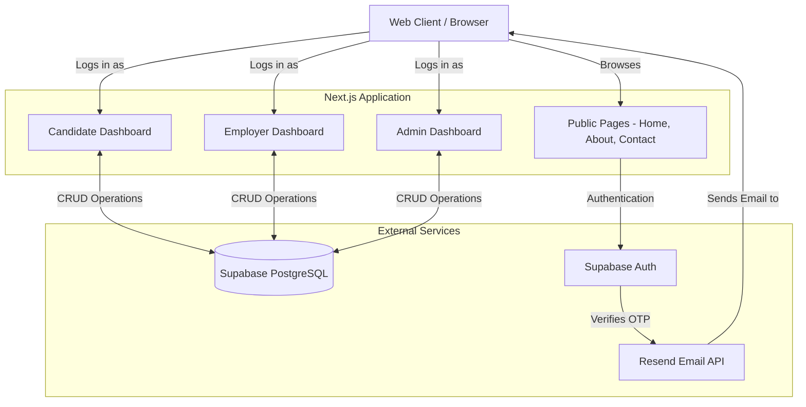

# SHIVYAM Management Services - Job Portal Platform

A modern, robust, and scalable job management and recruitment platform built for SHIVYAM Management Services. The platform connects candidates with employers, providing an end-to-end recruitment lifecycle system managed seamlessly by an administrative dashboard.

## 🚀 Tech Stack

- **Framework**: [Next.js 15](https://nextjs.org/) (App Router)
- **Styling**: [Tailwind CSS v4](https://tailwindcss.com/) + [Framer Motion](https://www.framer.com/motion/)
- **Database & Auth**: [Supabase](https://supabase.com/)
- **Email Delivery**: [Resend](https://resend.com/) & [React Email](https://react.email/)
- **Deployment**: [Vercel](https://vercel.com/)

---

## 🏗 System Architecture

The application is structured into three main user portals, all interacting with the Supabase backend and Resend for transactional communications.



---

## 🔑 Key Features

### 1. Multi-role Authentication & Dashboards
- **Candidates**: Profile management, resume uploads, and job application tracking.
- **Employers**: Job posting management, applicant tracking system (ATS), and company profile management.
- **Administrators**: Complete overview of platform activity, user management, and moderation tools.

### 2. Secure OTP Email Verification
- Custom email templates built with React Email.
- Real-time dynamic OTP delivery using Resend API.
- Passwordless and secure login capabilities integrated directly with Supabase Auth.

### 3. Beautiful & Responsive UI
- Fully responsive design engineered with Tailwind CSS.
- Engaging micro-interactions and smooth page transitions using Framer Motion.
- Distinctly tailored branding matching SHIVYAM Management Services.

---

## 🛠 Local Development Setup

Follow these steps to set up the project locally on your machine.

### Prerequisites
- Node.js 18.x or later
- npm, yarn, or pnpm
- Supabase Project
- Resend Account

### 1. Clone the repository
```bash
git clone https://github.com/your-username/shivyam-job-webste.git
cd shivyam-job-webste
```

### 2. Install dependencies
```bash
npm install
```

### 3. Environment Variables
Create a `.env` file in the root of the project and populate it with your specific service keys:

```env
# Supabase Configuration
NEXT_PUBLIC_SUPABASE_URL=your_supabase_project_url
NEXT_PUBLIC_SUPABASE_ANON_KEY=your_supabase_anon_key
SUPABASE_SERVICE_ROLE_KEY=your_supabase_service_role_key

# App Configuration
NEXT_PUBLIC_APP_URL=http://localhost:3000

# Resend Email Configuration
RESEND_API_KEY=your_resend_api_key
EMAIL_FROM="SHIVYAM Management Services <noreply@yourdomain.com>"

# Admin Credentials
ADMIN_EMAIL=admin@gmail.com
ADMIN_PASSWORD=your_admin_password
ADMIN_PIN=1234

# Database Password
DB_PASS=your_db_password
```

### 4. Run the development server
```bash
npm run dev
```

Open [http://localhost:3000](http://localhost:3000) with your browser to see the result.

---

## 📦 Deployment

This project is optimized for deployment on [Vercel](https://vercel.com).

1. Push your code to your GitHub/GitLab repository.
2. Import the project in Vercel.
3. Add the environment variables from your `.env` file into the Vercel Dashboard (Settings > Environment Variables).
4. Click **Deploy**.

> **Note**: Whenever you update an Environment Variable in Vercel, you must manually trigger a new deployment (Redeploy) for the changes to take effect.
